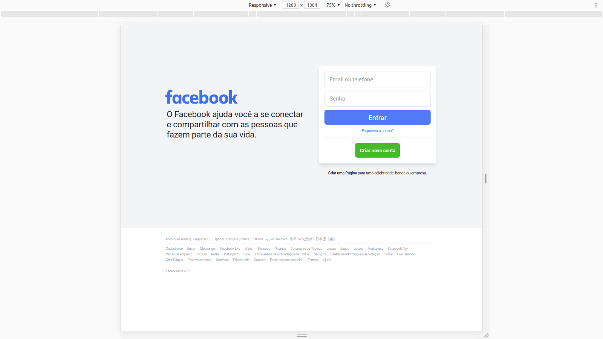
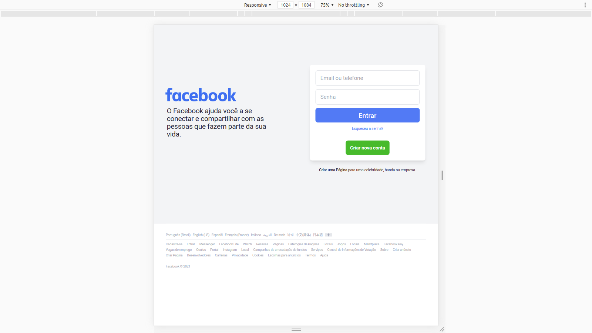
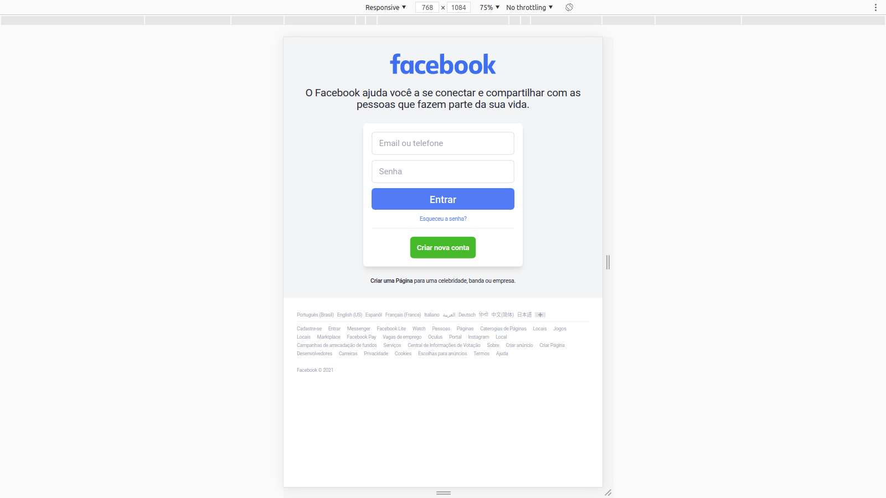
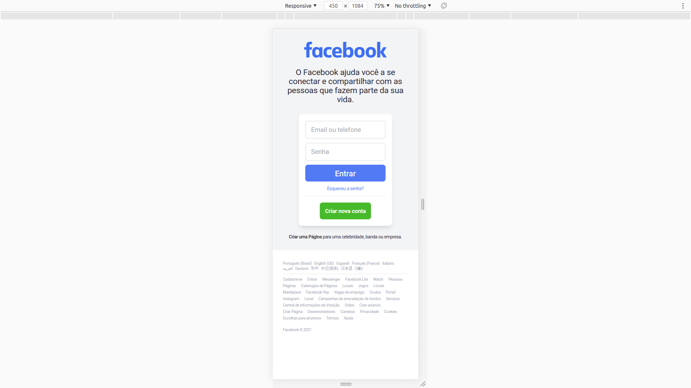

# A clone of Facebook made with Tailwind CSS

## Demonstration:
 
 
 
 
 
 

 ## Techs:

 * HTML
 * [Tailwind CSS](https://tailwindcss.com/)

 ## Author:

 **Renzo Sevilha**
 
 Find me:

[Linkedin](https://www.linkedin.com/in/renzo-sevilha/)

### Referências:

[Facebook](https://www.facebook.com/)